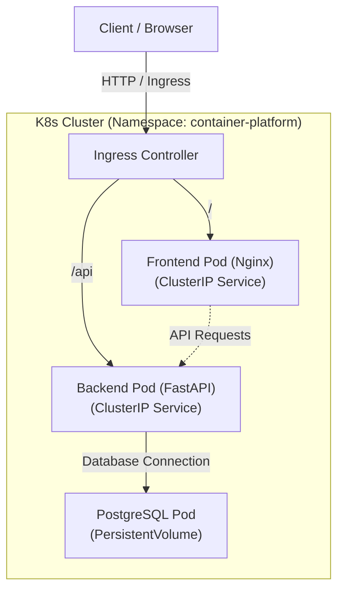

# Container Platform Stack

A production-ready, multi-tier microservices architecture demo containerized with **Docker** (using multi-stage builds and modern tooling) and orchestrated using **Kubernetes**. Designed for local development on Linux environments (Minikube / Kind).

---

## 🏗️ Architecture Overview

The application follows a classic 3-tier architecture isolated within a dedicated Kubernetes namespace (`container-platform`):

- **Frontend Tier:** Nginx Alpine serving a lightweight static UI.
- **Backend Tier:** FastAPI (Python 3.12.1) managed with `uv`, implementing health checks and environment decoupling.
- **Data Tier:** PostgreSQL 16 with persistent storage via PersistentVolumeClaims (PVC) and secure secrets management.


---

## 📂 Repository Structure

```text
container-platform-stack/
├── Makefile                           # Automation tasks for build & deploy
├── README.md                          # Project documentation
├── apps/                              # Application source code
│   ├── backend/
│   │   ├── Dockerfile                 # Multi-stage build (Python 3.12.1 + uv)
│   │   ├── pyproject.toml             # Dependency management
│   │   └── main.py                    # FastAPI application
│   └── frontend/
│       ├── Dockerfile                 # Multi-stage build (Nginx Alpine)
│       └── html/
│           └── index.html             # Web interface
└── k8s/                               # Kubernetes manifests
    ├── namespace.yaml
    ├── configmap.yaml
    ├── secrets.yaml
    ├── database/                      # PVC, Deployment, Service
    ├── backend/                       # Deployment, Service, Probes
    ├── frontend/                      # Deployment, Service
    └── ingress.yaml                   # Traffic routing
```
---

## 🚀 Quick Start / Local Deployment

Prerequisites
- Docker & Docker CLI
- A local Kubernetes cluster running on Linux (Minikube or Kind) with an Ingress Controller enabled.
- `kubectl` configured and pointing to your cluster.

### 1. Build Docker Images

Build the container images locally:

```bash
make build-all
```
(If using Kind or Minikube, make sure to load the images into your cluster if required, e.g., `kind load docker-image local/container-platform-backend:latest`)

### 2. Deploy to Kubernetes

Apply all manifests using the automation tool:

```bash
make apply
```

### 3. Check Status

Monitor the deployment progression:

```bash
make status
```

### 4. Cleanup

To remove all deployed resources from the cluster:

```bash
make delete
```

---

## 🛠️ Highlights

- Multi-Stage Docker Builds: Optimized image footprints by separating build dependencies from final runtimes.
- Modern Python Tooling: Backend dependencies managed efficiently using Astral's uv and pyproject.toml.
- Security Best Practices: Containers configured to run under non-privileged security contexts.
- High Availability & Reliability: Configured replicas (replicas: 2), livenessProbe, and readinessProbe for zero-downtime orchestration.
- GitOps-Ready Manifests: Clear structural separation of configuration, secrets, state, and workloads.